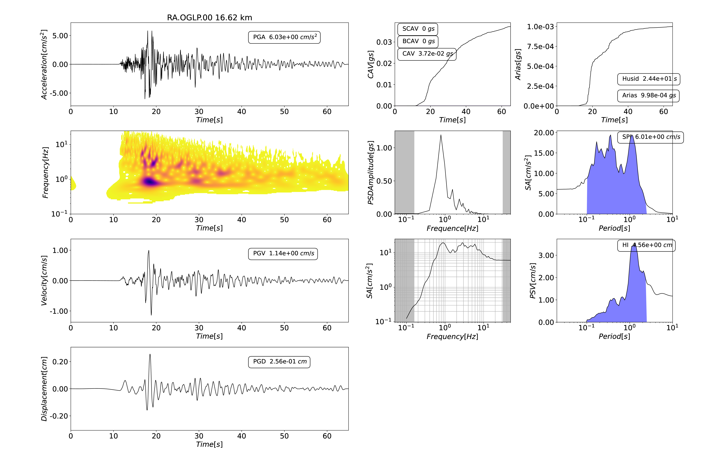
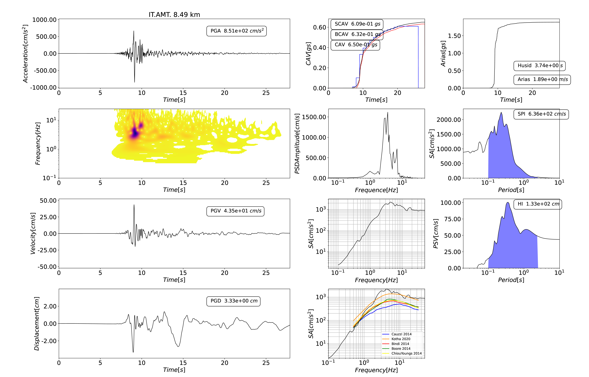

# Example of codes using `signal_analysis` class 
**Author: Maria LANCIERI** 

This directory containes several python codes applying the `signal_analysis` class to different file format, namely: K-net and KiK-net, Orfeus ESM, SAC, mseed.

**The codes in this directory are distrubuted to test the correct installation of all the packages and give an outlook on the potential of `signal_analysis` class, the users cas adapt them to their needings or writing new ones from scratch.**

**The codes are not supposed to be further developped since they are fitted for the case of study.**


The Example directory containes the folowing python codes:

       
* `IM_Analysis_BosaiKiKNet.py` - Application to Japanese Bosai format
* `IM_Analysis_OrfeusRaw.py`  - Application to Orfeus European format
* `IM_Analysis_OrfeusCorr.py`  -  Application to Orfeus European format for manually processed data 
* `IM_Analysis_OrfeusCorr_GMPE.py` - Application to Orfeus European format for manually processed data with comparaison with GMPE  
* `IM_Analysis_SAC.py`  - Application to files in SAC format    
* `IM_Analysis_mseed.py`   - Applicatopm to files in mseed
* `plot_par.py` - support routines for plots
      

and the following sub directories:

* Input 
* Output 
* FIGURES 

## Hints on how to handle the outputs of `signal_analysis` class

### Dictionary of outputs

Al the example codes handle the input output using pickle, the idea is to create an archive collecting all the information on waveform. Beside de format (I use pickle because it is an intermediate output to be used as input in following codes), the idea implemented in these codes is to group the two components  in a larger dictionary identified by the network, station and location. This strategy make strateforward to combine the two components. 


```python
import pickle
…
filename = "Parameters_IM“
fout = open(filename, 'w+b')
Parameters = {}
Trace_name = ("%s.%s.%s") % (tr.stats.network, tr.stats.station, tr.stats.location)
Parameters[trace_name] = {}
Parameters[trace_name]['station'] = {}    
Parameters[trace_name][component] = {}

Parameters[trace_name]['station']['stla'] = tr.stats.sac.stla    
Parameters[trace_name]['station']['stlo'] = tr.stats.sac.stlo    
Parameters[trace_name]['station']['distance'] = dist

Parameters[trace_name][component]['time'] = time     
Parameters[trace_name][component]['acceleration'] = acc    
Parameters[trace_name][component]['velocity'] = vel     
Parameters[trace_name][component]['displacement'] = spo 
Parameters[trace_name][component]['freq_psd'] = freq_welch    
Parameters[trace_name][component]['psd'] = trace_welch 
Parameters[trace_name][component]['cav']   = cav    
Parameters[trace_name][component]['scav']  = scav    
Parameters[trace_name][component]['bcav']  = bcav    
Parameters[trace_name][component]['arias'] = ari         
Parameters[trace_name][component]['husid'] = husid    
Parameters[trace_name][component]['freq_response'] = freq    
Parameters[trace_name][component]['sa']  = psa        
Parameters[trace_name][component]['psv'] = psv    
Parameters[trace_name][component]['spi'] = spi    
Parameters[trace_name][component]['hous'] = hous

pickle.dump(Parameters, fout)
```

### Figure :  The waveform ID

The code in example creates a visual output, a sort of ID of the wavefom showing the computed IM their evolution with time (or frequency in the case of power spectral density of response specra).
 




