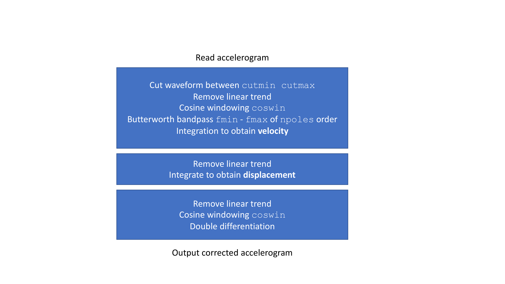

# Strong Ground Motion Signal Analysis for Engineers and Seismology
***Author : Maria LANCIERI***

The python class `signal_analysis` computes a set of intensity measures (IM) caracterising the seismic signal for earthquake engineering.

The class is distributed with several example routines to show its potential in reading several input formats (ORFEUS, K-Net and KiK-net Bosai networks), example based on mseed and sac formats are distributed too.

## Dependencies
The class requires [scipy], `obspy,` `numpy` and [stockwell] packages. 

For GMPE option OpenQuake GSIM hazardlib is required as well.
If the user is not interested in GMPE and/or encounter issues with OpenQuake instation the `computegmpe` and `read_gmpeinput` routines can be commented with no consequences on the other functions.

The exemple routines require `pickel` `glob` `pyproj` packages


## Class purposes

Compute baseline corrected accelerograms to be used as input for dynamic structure response analysis. It computes a suite of classical intensity measures. The class can handle different data format and units.

### What the class does not do

The pre-processing of the waveform to establish the cut interval or the baseline correction parameters.

The class works with the user input: real or synthetic data.

The class is designed to work with a single component per time, it does not combine component computing rot50, geometric mean and so on.
In the exemple routines a data structure allowing to easly recompute the combined parameter is suggested.

## Class structure 

The structure of the `signal_analysis` class is the following:


`read_knet()` or `read_orfeus()` and `baseline()` routines are mandatory since they create the `self` and the `tr` (trace) object with the attributes used in the class function. 

### Content of tr object with attributes

Header information on seismic event

`tr.hdr.evname` 
`tr.hdr.evid`
`tr.hdr.evdate`
`tr.hdr.evtime`
`tr.hdr.evla`
`tr.hdr.evlo`
`tr.hdr.evdp` 
`tr.hdr.mw`
`tr.hdr.ml`
`tr.hdr.foca`

**Mandatory station attributes**

`tr.stats.network`
`tr.stats.station`
`tr.stats.location`
`tr.stats.channel `

Further station information

`tr.stats.stnm `                
`tr.stats.sac.stla`
`tr.stats.sac.stlo `
`tr.stats.sac.stelv` 
`tr.stats.vs30 `
`tr.stats.sclass`
`tr.stats.epi`

**Mandatory trace attributes**

`tr.stats.delta`   
`tr.stats.npts`                    
`tr.data`


**If mseed or SAC format are used, it is important to creare a tr attribute with the mandatory information,** two exemples are available in the exemple routines. The `tr` object is indeed inspired the obspy.read output.

**In any case the routine `baseline` must be evoked** since it creates the self object with waveform amplitude (in acceleration, velocity and displacement), time, sample interval. 
If manual processed waveforms are used 

## How to use the class

```python
import signal_analysis
tool = signal_analysis.mytools()
tr = tool.read_orfeus(tracename)  # `tracename` is a string 
delta = tr.stats.delta
npts  = tr.stats.npts
time = np.arange(npts)*delta

time,acc,vel,spo, fminu, fmaxu = tool.baseline(tr.data,time,cutmin=cut[cname][0],cutmax=cut[cutname][1],const=1 )  

pga = tool.pga()    
pgv = tool.pgv()    
pgd = tool.pgd() 
scav,scavtime, cav,cavtime, bcav, bcavtime = tool.cav(unit='cm/s2')    
ari,aritime,husid = tool.arias(unit='cm/s2')    
stock,X,Y,extent =  tool.stockwell(acc,time)    
freq =  np.logspace(-1,np.log10(50),100)    
psa, psv, freq = tool.response(freq=freq) 
spi  = tool.specint('sa')    
Hous = tool.specint('psv')

# the following line is an exemple for power density function computation, for a single line it is not worth to define a class function.
freq_welch, trace_welch = welch(acc, fs=(1/delta),nperseg=1024)

```

## Technical and scientific overview of the `signal_analysis` class functions

### baseline

```
 def baseline (self,acc,time,**kwargs):
        """
        acc  : array 
        time : array
        A bandpass Butterworth filter zero phase shift is applied, the kwargs are:
        fmin   : the high-pass cutoff filter frequency, default 0.1
        fmax   : the low-pass  cutoff filter frequency, default Nyquist frequency
        npoles :number of poles, default 4
        
        coswin : cosine windowing lenght in percentage of signal length, default is 0.1
        
        const : normalization value (i.e. 9.8), default is 1 it is applied only to acceleration
    
        cutmin : cut window beg time, default time[0]
        cutmax : cut window beg time, default time[-1]
        
        base : "Non" if MP waveform, type=str defaul "Yes"
    
        """
```

The baseline procedure is the following



The class has been adapted to work with velocity signals (mseed from broad-band networks), in this case a `baseline_vel()` function must be used to compute acceleration and displacement.

#### Scientific Warning on Baseline Correction

Some waveforms require to filter the velocity and/or displaccement as well, in my opinion this is a strong signal manipulation that has to be carefully checked and it can not be performed automatically. On the basis of my experiece, difficulties in correcting waveforms are related to:

*  missed samples;
*  bad installation condition (sensor shift, objects falling near the sensor during the shaking);
*  finite displacement.

Each of this case requires specific strategies of signal correction, none of them is implemented in `signal_analysis`.

Indeed, to allow the user compute the intensity measure on manually processed waveforms, the  `baseline()` function can be used with the kwarg option  `base="Non"` 

A further warining on waveforms with finite displacement:
the `baseline()` function is designed to output accelerograms for structural computing forcing displacement to go to zero in the end of trace.
It is not suited to study records affected by finite displacement; if the baseline procedure is applied in this specific case the displacement waveform will be caracterized by a low frequency trend occurring *before* the P-wave arrival.

When `baseline_ve()` is used it is possible to filter velocity waveforms.

It is not suitable to apply baseline twice, for these reason, when manual 
### Peak amplitude (PGA, PGV and PGD)

The functions `pga()` `pgv()` `pgd()` read the corrected acceleration, velocity and displacement and output the absolute maximum.


### The Cumulative Absolute Velocity (CAV)

```python
  """
    ~~~~~~~~~~~~~~~~~~~~~~~~~~~~~~~~~~~~~~~~~~~~~~~~~~~~~~~~~~~~~~~~~~~~~~~~~~~
       CAV calculation    
       EPRI 1988 -> CAV
       RFS V.II  -> Bracketed CAV
       EPRI 2006 -> Standardizd CAV
    ~~~~~~~~~~~~~~~~~~~~~~~~~~~~~~~~~~~~~~~~~~~~~~~~~~~~~~~~~~~~~~~~~~~~~~~~~~~
    """

    def cav (self, **kwargs):
    
        """
        the kwargs unit :  string g,cm/s2 or m/s2 
        since the baseline normalize the acceleration the default value is g

        the 3 CAV are computed
        scav :  standardized CAV 
        cav  :  classical cav
        bcav : bracketed duration cav (5% of g)
        """    
      unit = "g"
        for key in kwargs:
            if key == "unit":    unit = kwargs[key] 

        if unit == "g"       :  const = 1
        elif unit == "cm/s2" :  const = 980
        elif unit == "m/s2"  : const = 9.8

        
        acc = self.acc/const

```
The CAV function compute the CAV following the 3 definitions of EPRI 1988, French regulatory code RFS V.II 2005 and the EPRI 2006. The output is in [gs], the amplitude normalization constant `const` is computed as a function of units of the input accelerogram for this reason **the unit kwargs is mandatory**.

#### The 3 definitions of CAV parameters  

The CAV parameter has been first introduced by the EPRI in 1988. It is defined as the integral of the absolute value of acceleration. To make the CAV computing less dependent on the signal cuts (in 1988 no continous records were available) two further CAV definition have been intoduced: the brackted CAV $CAV_{BD}$ and the standardized CAV ($SCAV$).

The $CAV_{BD}$ is defined as the integral of absolute value of the acceleration over the time window where the acceleration amplitude is larger than 5% of g. For weak motions it can be equal to zero.


The $SCAV$ is the integral of the absolute value of the accelerogram computed over slinding, non overlaping, windows of 1 second of duration if the acceleration amplitude in the window is greater than 0.025 g. For weak motions it can be equal to zero.

A conceptual sketch and the corresponding equations are illustred here:


### The Arias intensity and the  Husid duration

```python
  """
    ~~~~~~~~~~~~~~~~~~~~~~~~~~~~~~~~~~~~~~~~~~~~~~~~~~~~~~~~~~~~~~~~~~~~~~~~~~~
     Arias Intensity 
     Defined as: pi/2g int[a(t)**2 dt]
     Defined in m/s the acceleration has to be in m/s2
    ~~~~~~~~~~~~~~~~~~~~~~~~~~~~~~~~~~~~~~~~~~~~~~~~~~~~~~~~~~~~~~~~~~~~~~~~~~~
    """
    def arias(self, **kwargs):
        """
        the kwargs unit :  string g,cm/s2 or m/s2 
        since the baseline normalize the acceleration the default value is g
        """    
        unit = "g"
        for key in kwargs:
            if key == "unit":    unit = kwargs[key] 

        if   unit == "g"     :  const = (1/9.8)
        elif unit == "cm/s2" :  const = 100
        elif unit == "m/s2"  : const = 1
     
        ncoef  = np.pi/(2*9.8)
        acc = self.acc/const * np.sqrt(ncoef)
        (...)
```
This routine compute the Arias intensity (AI), the Husid duration (defined as time interval where the AI varies from 5% to 95% of its final value).

As for the CAV function the waveform unit is mandatory.

The routine also gives in output the evolution of AI as a function of time.

#### The accelerogram normalization for Arias intensity estimation

The Arias intensity is originally defined as 

 and expressed in m/s.

To avoid any confusion with the use of constant g, I decided to go back to the original definition and to convert the acceleration in $m/s^{2}$ before applying the Arias (1970) equation.

### The spectral intensities 
```python
       """
        ~~~~~~~~~~~~~~~~~~~~~~~~~~~~~~~~~~~~~~~~~~~~~~~~~~~~~~~~~~~~~~~~~~~~~~~~~~~
         Spectral Intensities
         Housner Instenisty defined as the integral of PSV between 0.1s and 2.5s
         Spectral Intensity defined as the integral of PSA between 0.1 and 0.5s
        ~~~~~~~~~~~~~~~~~~~~~~~~~~~~~~~~~~~~~~~~~~~~~~~~~~~~~~~~~~~~~~~~~~~~~~~~~~~
        """
    
    def specint (self,pst):
        """
        :param psds : pseudo spectrum (frequency, amplitude) , type numpy.array 
        :param pst : pseudospectrum type,  type boolean (psa=1 psv=0)     
        """
        if pst=="sa":
            pmin = 0.1
            pmax = 0.5
            rsp = self.sa
        elif pst=="psv":    
            pmin = 0.1
            pmax = 2.5
            rsp = self.psv
           
```

This function computes the spectral intensities following the original Housner definiton : 


 where SV is the response spectrum in velocity and the integral is performed between 0.1 s and 2.5 s.
An option is also proposed to compute a SI from the integral of response spectrum in acceleration between 0.1 and 0.5 seconds.


To take into account the odd period spacing (the spectral periods are log spaced) the integral is computed as Rienmann integral.

### Stockwell Transform

```python
    def stockwell(self,data,tempo):

        """
        :param data : array of amplitude, type=np.array
        :parm tipe : array of time samples, type=np.array
        """
```

The Stockwell transform function requires as input the ampliutde and the time, it gives the possibility to compute it on acceleration, velocity or displacement.

The code is basically based on the code originally developped at [NIMH MEG Core Facility] and implemented in [stockwell] package.

#### The S-transform

The Stockwell transform (Stockwell et al. 1996) provides a time-frequency representation of the signal. The S-transform can be interpreted as an extension of the continuous wavelet transform with Gaussian windowing, as the mother wavelet with a non-null average, and dilation factor equal to the inverse of the frequency (Simon et al. 2007, Ventosa et al. 2008). The S-transform, S(t,f), is defined as: 


where h(t) is the time history.

The integral of the S-transform along the time axis is simply the Fourier transform of the time-series h(t), and therefore S(t,f) can be interpreted as a power density spectrum unrolled along the time axis. 

#### Warning on Stockwell Transform
The [stockwell] package is fast and it can be used on long time histories, however the output, given by an imaginary matrix, can be difficult to handle and to plot; in same case the plot operation leads to overflow error.

I thus suggest to not compute the Stockwell transform on uncutted signals, in the exemple reading an mseed streaming the S-transform is not computed.

Moreover, in the code the signal is undersampled to a Nyquist of 25 Hz to compute the S-transform. 
On the basis of my experience beyond this value the time-frequency analysis of seismic signal is not interesting because of the poor energy content (effetcs of the instrumental response, the siting and so on).

### The GMPE computing

The class contains two functions `computegmpe()` and `read_gmpeinput()` based on OpenQuake hazardlib
The input of the `computegmpe()`  are listed below

```python

   def computegmpe(self, gmpe, freq, mag, depth, ztor, dip, rake, Rx, Rrup, Rjb, Epi, vs30):  

        """
        :param gmpe : name of the GMPE on the bases of OQ GSIM list, type=str
        :param freq_gmp : frequencies, type=np.array
        :param mag : event magnitude, type=float
        :param depth : event depth, type=float
        :param ztor : ztor paramaters, type = float
        :param dip : fault dip, type=float
        :param rake : fault rake, type = float
        :param  Rx : Rx parameters, type =float
        :param Rrup : distance from the rupture, type = float 
        :param Rjb : Joyner and Boore distance, type = float
        :param Epi : epicentral distance, type = float
        :param Vs30: velocity of S waves in first 30 meters, type =float

        """
```

The gmpe name must be given in accordance with the OpenQuake hazardlib GSIM routine; to obtaine the list of GMPE implemented in OpenQuake

```python
    from openquake.hazardlib import gsim, imt
       AVAILABLE_GSIMS = gsim.get_available_gsims()        
       print (AVAILABLE_GSIMS)
```
The second routine `read_gmpeinput()` organises the input parameters following the OpenQuake hazardlib GSIM routine requirements, the user do not access to this process; however, this is the routine that will be eventually updated following the GSIM developpements.


[NIMH MEG Core Facility]: https://kurage.nimh.nih.gov/meglab/Meg/Stockwell
[stockwell]: https://github.com/claudiodsf/stockwell
[scipy]: https://scipy.org

